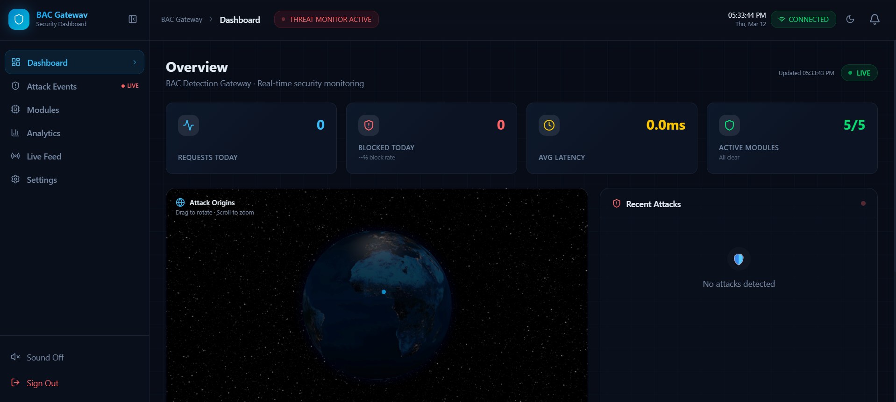
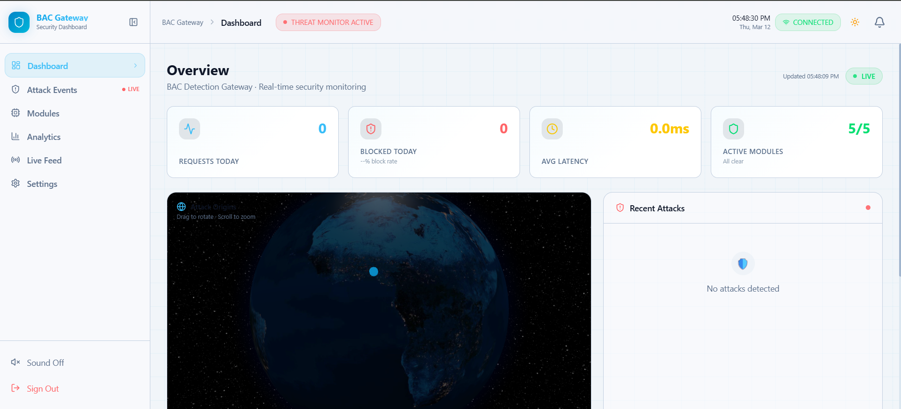
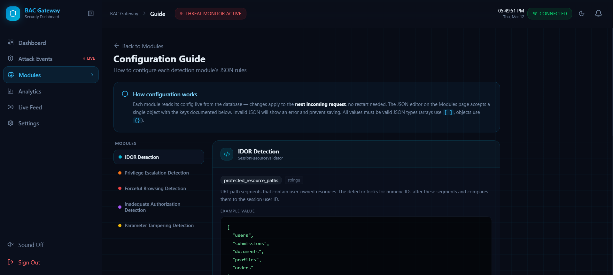
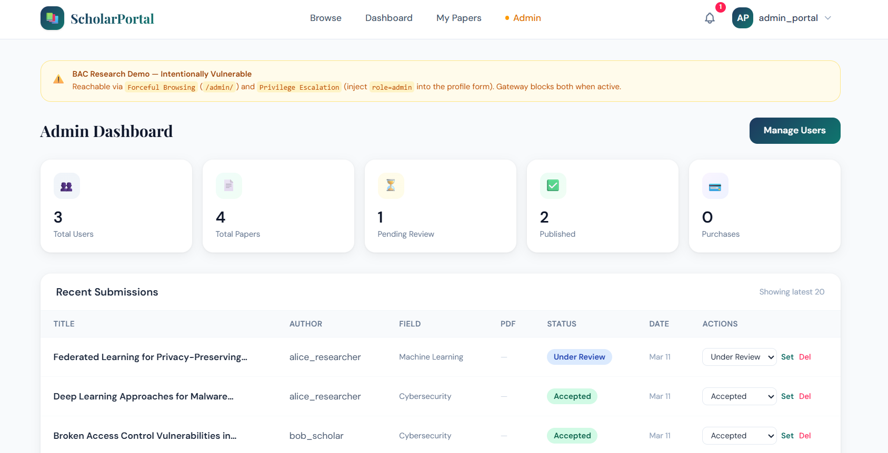
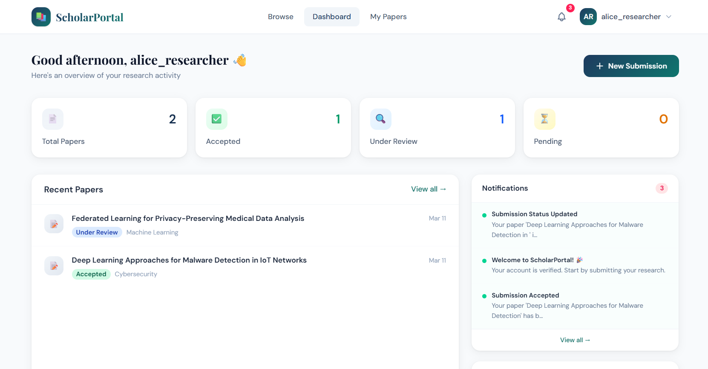

<div align="center">

# 🛡️ BAC Security Gateway

**A real-time, rule-based API gateway that detects and blocks Broken Access Control attacks**

[](https://python.org)
[](https://fastapi.tiangolo.com)
[](https://mongodb.com)
[](https://nextjs.org)
[](LICENSE)

</div>

---

## Overview

BAC Security Gateway sits in front of your application and intercepts every incoming request, running it through five parallel detection modules in real time. Attacks are blocked before they ever reach your app. All events are logged, queryable, and visualised on a live admin dashboard.

```
Client Request
      │
      ▼
┌─────────────────────┐
│   BAC Gateway       │  ← FastAPI · Python
│   (port 8000)       │
│                     │
│  ┌───────────────┐  │
│  │ Detection     │  │
│  │ Engine        │  │
│  │               │  │
│  │ ① IDOR        │  │
│  │ ② Priv. Esc.  │  │
│  │ ③ Force. Brow │  │
│  │ ④ Inad. Auth  │  │
│  │ ⑤ Param. Tamp │  │
│  └───────────────┘  │
│         │           │
│    Block / Allow    │
└─────────────────────┘
      │           │
   BLOCKED      PROXIED
    (403)          │
                   ▼
        ┌─────────────────┐
        │  Your App       │  ← ScholarPortal (Flask)
        │  (port 5000)    │
        └─────────────────┘
```

---

## Screenshots

### Admin Dashboard — Dark Mode


### Admin Dashboard — Light Mode


### Configuration Guide — Dark Mode


### ScholarPortal — Vulnerable Demo Site
> The intentionally vulnerable target app used for demonstrating BAC attack detection.

> Admin Side


> Researcher Side

---

## What's in This Repo

| Component | Stack | Port | Description |
|-----------|-------|------|-------------|
| `gateway/` | FastAPI, Python | `8000` | Detection & proxy engine |
| `vulnerable_site/` | Flask, PyMongo | `5000` | Demo target app with intentional BAC flaws |
| `bac-gateway-dashboard/` | Next.js 14, TypeScript, Tailwind CSS | `3000` | Admin UI — live monitoring & rule configuration |

---

## Detection Modules

| # | Module | Attack Type | Example |
|---|--------|-------------|---------|
| 1 | `idor.py` | Insecure Direct Object Reference | Accessing `/submissions/OTHER_USER_ID` |
| 2 | `privilege_escalation.py` | Privilege Escalation | Posting `role=admin` to gain elevated access |
| 3 | `forceful_browsing.py` | Forceful Browsing | Directly visiting `/admin` without authentication |
| 4 | `inadequate_auth.py` | Inadequate Authorization | Downloading a resource without the required scope |
| 5 | `parameter_tampering.py` | Parameter Tampering | Changing `?price=99` to `?price=0` in the URL |

---

## Getting Started

### Prerequisites

- Python 3.11+
- Node.js 18+
- A [MongoDB Atlas](https://mongodb.com/atlas) account (free tier works)
- Git

### 1. Clone the repository

```bash
git clone https://github.com/war-riz/bac-gateway.git
cd bac-gateway
```

### 2. Set up the Python environment

```bash
python -m venv venv

# macOS / Linux
source venv/bin/activate

# Windows
venv\Scripts\activate

pip install -r requirements.txt
```

### 3. Configure environment variables

```bash
cp .env.example .env
```

Open `.env` and fill in at minimum. Also check other README.md in dashboard and vulnerable site for more information:

```dotenv
MONGODB_URL=mongodb+srv://<user>:<password>@<cluster>.mongodb.net/
SECRET_KEY=your-random-secret-key-here
```

> The gateway, vulnerable site, and dashboard each have their own additional env vars.
> See the relevant README for each:
> - Vulnerable site → [`vulnerable_site/README.md`](vulnerable_site/README.md)
> - Admin dashboard → [`bac-dashboard/README.md`](bac-gateway-dashboard/README.md)

### 4. Generating a SECRET_KEY

The gateway uses SECRET_KEY to sign JWTs. Generate a secure one with:
```bash
python -c "import secrets; print(secrets.token_hex(32))"
```
Paste the output into your `.env` as `SECRET_KEY`.

### 5. Run all three services

Open **three terminals**, all from the project root:

```bash
# Terminal 1 — Gateway (FastAPI)
python main.py

# Terminal 2 — Vulnerable demo site (Flask)
python -m vulnerable_site.app

# Terminal 3 — Admin dashboard (Next.js)
cd bac-gateway-dashboard && npm install && npm run dev
```

| Service | URL |
|---------|-----|
| Gateway API | http://localhost:8000 |
| API docs (Swagger) | http://localhost:8000/docs |
| Health check | http://localhost:8000/api/v1/health |
| Vulnerable demo site | http://localhost:5000 |
| Admin dashboard | http://localhost:3000 |

> ⚠️ Always use `python -m vulnerable_site.app` (not `python vulnerable_site/app.py`) — the `-m` flag ensures Python resolves module imports correctly from the project root.

---

## API Reference

All protected endpoints require a Bearer JWT from `/api/v1/auth/login`.

```bash
curl -X POST http://localhost:8000/api/v1/auth/login \
  -H "Content-Type: application/json" \
  -d '{"email": "admin@bacgateway.com", "password": "Admin@123456"}'
```

| Method | Endpoint | Auth | Description |
|--------|----------|------|-------------|
| `POST` | `/api/v1/auth/login` | — | Obtain JWT |
| `GET` | `/api/v1/health` | — | Service health |
| `GET` | `/api/v1/dashboard/summary` | Admin JWT | Aggregated stats |
| `GET` | `/api/v1/events` | Admin JWT | Security event log |
| `GET` | `/api/v1/configs` | Admin JWT | Detection module config |
| `PATCH` | `/api/v1/configs/{module}/toggle` | Admin JWT | Enable / disable a module |

---

## Project Structure

```
bac-gateway/
├── main.py                          ← Gateway entry point
├── requirements.txt                 ← Python dependencies
├── .env.example                     ← Copy to .env and fill in credentials
├── .gitignore
├── docker-compose.yml
│
├── gateway/                         ← FastAPI application
│   ├── config/settings.py           ← Pydantic settings (reads from .env)
│   ├── db/database.py               ← MongoDB Atlas connection
│   ├── detection/                   ← The 5 BAC detection modules
│   ├── middleware/                  ← Request interception & proxying
│   ├── api/v1/endpoints/            ← REST API routes
│   ├── models/                      ← Beanie ODM documents
│   ├── schemas/                     ← Pydantic shapes
│   ├── services/                    ← Business logic
│   ├── core/dependencies.py         ← Auth guards
│   └── utils/security.py            ← JWT, bcrypt, HMAC
│
├── vulnerable_site/                 ← Flask demo app — see vulnerable_site/README.md
├── bac-gateway-dashboard/           ← Next.js admin UI — see bac-gateway-dashboard/README.md
├── docs/
│   └── images/                      ← Screenshots used in this README
│       ├── dashboard-dark.png
│       ├── dashboard-light.png
│       └── scholar-portal.png
└── tests/
```

---

## Running with Docker

```bash
docker-compose up --build
```

Starts the gateway and vulnerable site in isolated containers on the same Docker network.

---

## Default Admin Account

Auto-seeded on first startup from your `.env` values:

| Field | Default |
|-------|---------|
| Email | `admin@bacgateway.com` |
| Password | `Admin@123456` |
| Username | `admin` |

Change these before deploying publicly.

---

## Roadmap

- [x] Detection engine — 5 BAC modules
- [x] FastAPI gateway with JWT auth
- [x] MongoDB event logging
- [x] Vulnerable demo site (ScholarPortal)
- [x] Next.js admin dashboard — live monitoring, rule config, 3D globe, analytics
- [x] Webhook / Slack alerts
- [ ] Docker production hardening
- [ ] Rate limiting module

---

<div align="center">
  Built for security research and education &nbsp;·&nbsp; Not for production use without hardening
</div>